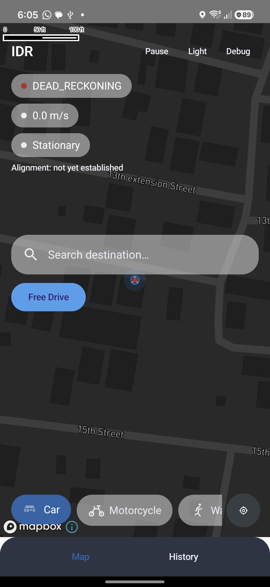
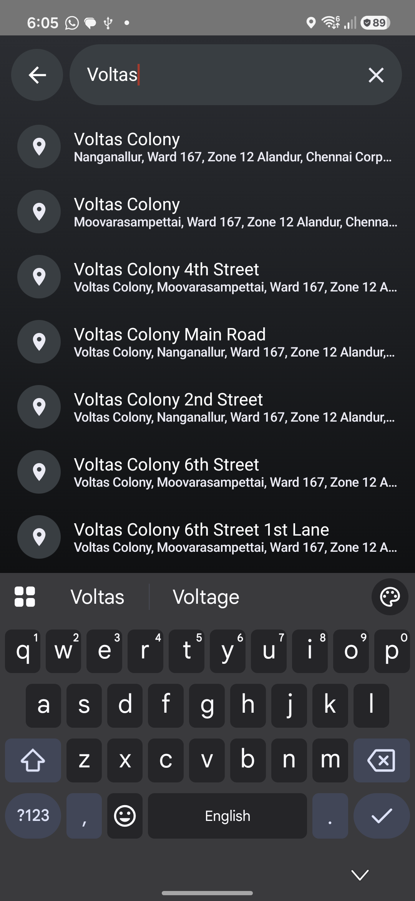
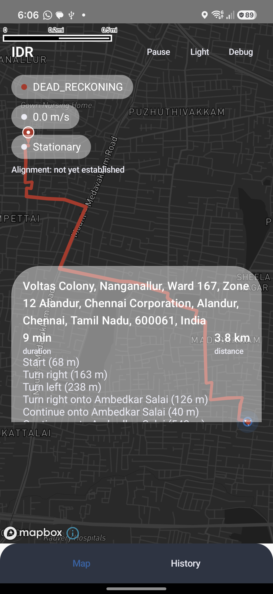
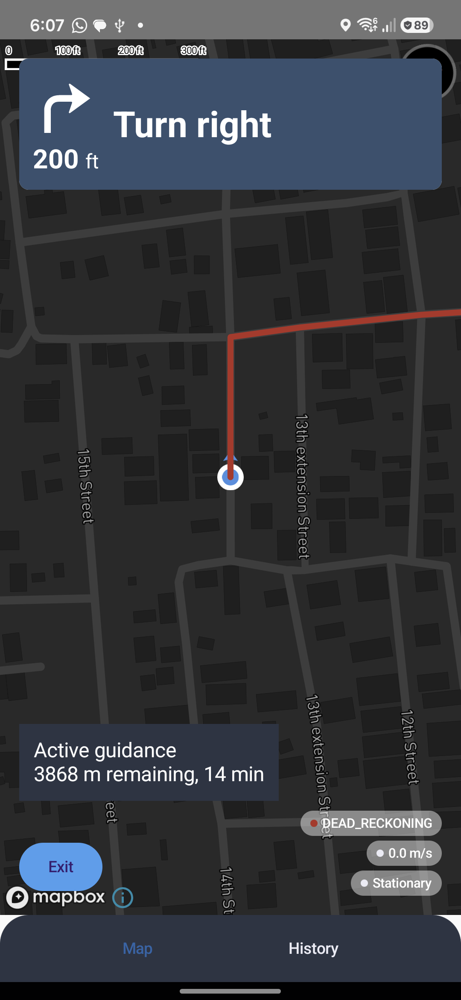
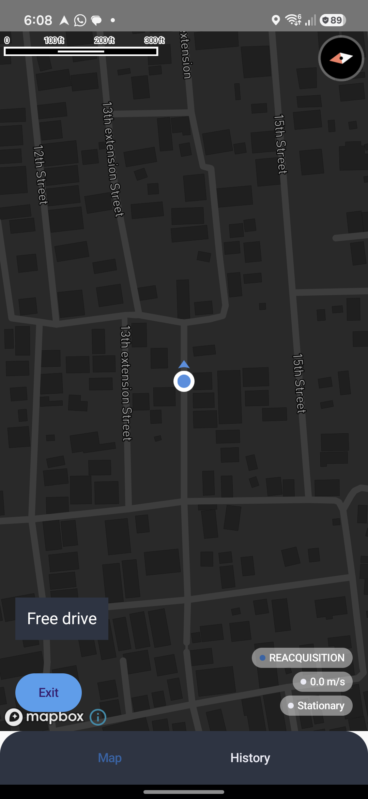
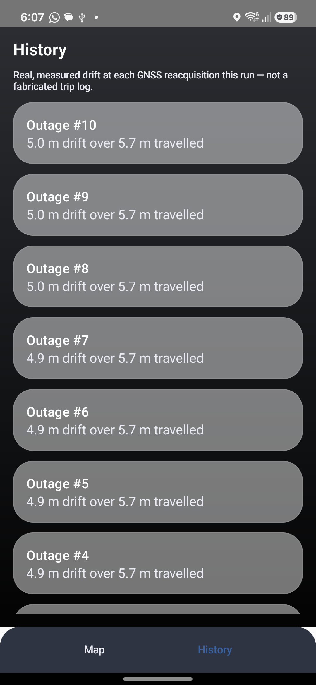

# IDR — Intelligent Dead Reckoning

**"Your phone doesn't lose navigation when GPS disappears."**

Smart India Hackathon · Problem Statement **26168** · ISRO
A real Android app that keeps navigating through tunnels, underpasses, multi-level parking, and urban canyons — using only the sensors already in the phone.

---

## The problem

Every consumer navigation app fails the same way in the same places: the
moment GNSS signal is lost — a highway tunnel, an underground parking ramp,
a metro underpass, a dense hill road cut through granite — the blue dot
either freezes, jumps, or silently extrapolates with a naive dead-reckoning
guess that drifts within seconds. ISRO's Problem Statement 26168 asks a
direct question: **can a smartphone, with no external hardware, keep
telling the truth about its own position through that gap** — by fusing
IMU data with GNSS/INS techniques, applying AI/ML for speed estimation,
filtering vibration/road noise, auto-aligning phone-to-vehicle, applying
non-holonomic constraints, and handing back a seamless GNSS↔DR transition?

**Official target** (illustrative, per the problem statement): drift under
10% of distance travelled during a blackout — under 5 m over 50 m in under
a minute; under 100 m over 1 km at 60 km/h.

## The solution

IDR is a real Android app, not a slide deck. Underneath a full navigation
UI (real street maps, destination search, voice-guided turn-by-turn with
banner/lane instructions, free drive, automatic rerouting) sits a
positioning engine that:

1. Reads accelerometer, gyroscope, and orientation at ~10 Hz.
2. Runs a **physics baseline** — semi-implicit Euler integration, corrected
   by zero-velocity updates (ZUPT) when genuinely still and a non-holonomic
   constraint (a car can't drift sideways, so the estimate isn't allowed to
   either).
3. Runs a **trained ML velocity model in parallel**, on-device, that beats
   the physics baseline by a measured 4.2× on real held-out driving data —
   this is what actually carries position through a GNSS gap.
4. Drives all of this through a **hysteresis-gated state machine**
   (`GNSS_AIDED → TRANSITION → DEAD_RECKONING → REACQUISITION`) so a single
   noisy GPS sample can never flip the whole system, and blends the
   dead-reckoned guess back toward GPS the instant the sky reopens —
   measuring the real drift at that exact instant instead of assuming a
   number.

No feature exists "because AI/ML is in the title" — see [`PRD.md`](PRD.md)
Section 30 (SIH WOW Factor) for the reasoning behind each one.

## Screenshots

| | |
|---|---|
|  **Live status overlay** — GNSS mode, speed, motion state, and phone-to-vehicle alignment, all reading from the same real pipeline described above, rendered over a real Mapbox street map. |  **Real destination search** — live OpenStreetMap/Nominatim results as you type, no mock data, no API key. |
|  **Real turn-by-turn routing** — an actual OSRM-computed route (3.8 km / 9 min) with real street-name steps. |  **Live guided navigation** — Mapbox Navigation SDK turn-by-turn: real banner + lane instructions, voice guidance, and the same GNSS/DR status chips (small, next to Exit) so the positioning story stays visible even mid-guidance. |
|  **Free drive** — no destination needed; a live map-matched, compass-heading position with the GNSS/DR pipeline still running underneath. |  **Honest drift log** — every number here is measured at the instant GPS was reacquired, not simulated or invented. |

## How it works

```
   GNSS_AIDED  ──degraded≥2s──▶  TRANSITION  ──still degraded──▶  DEAD_RECKONING
        ▲                                                              │
        │                                                              │ fix reacquired
        └──────────────────  REACQUISITION  ◀───────────────────────────┘
             (blends DR guess toward the new fix,
              measures the real drift at this instant)
```

- **`GNSS_AIDED`** — fix is fresh and accurate; position comes straight from GPS.
- **`TRANSITION`** — signal degrading; the last good position is frozen, not extrapolated blindly.
- **`DEAD_RECKONING`** — no usable fix; the physics baseline and the trained ML model carry the position forward, in parallel, so they can be compared honestly.
- **`REACQUISITION`** — the dead-reckoned position blends back toward the new GPS fix over a short window, and the gap between "where DR thought we were" and "where GPS says we actually are" is captured as a real, on-screen drift number.

Every transition is logged with its trigger condition, so a test run can be
replayed and the timing verified after the fact instead of just trusted.

## Real, measured results

No number below is assumed or invented — see [`docs/PROJECT_MAP.md`](docs/PROJECT_MAP.md) for the full derivation of each.

| Metric | Result |
|---|---|
| ML velocity model vs. physics+ZUPT baseline | **4.2× more accurate** (MAE 1.244 m/s vs. 5.205 m/s, RMSE 1.593 vs. 6.345 m/s — IO-VNBD dataset, held-out trips) |
| Recurring service cost | **₹0** — Nominatim search and OSRM routing are free and keyless; Mapbox map rendering + Navigation SDK run on its free tier (usage-notification alerts set well below the cap, never billed) |
| Test device | Samsung Galaxy S24 FE (Android 16 / One UI 8.5) — every number above was measured on real hardware, not a simulator |
| At-rest drift after ZUPT | Reduced from several metres to near-zero over 15+ seconds of real stationary testing |

## Tech stack

**Android app** — Kotlin, Jetpack Compose, coroutines/`StateFlow`
- **Sensors**: Android `SensorManager` (accelerometer, gyroscope, rotation vector) at ~10 Hz, on a dedicated background thread
- **On-device ML inference**: [ONNX Runtime Mobile](https://onnxruntime.ai/) (`onnxruntime-android`)
- **Maps**: [Mapbox Maps SDK](https://docs.mapbox.com/android/maps/guides/) rendering OpenStreetMap-derived street tiles — keeps the same basemap geometry the OSRM routing/road-snap logic below already relies on
- **Turn-by-turn guidance**: [Mapbox Navigation SDK](https://docs.mapbox.com/android/navigation/guides/) — real voice guidance, banner + lane instructions, automatic rerouting on off-route, and a free-drive (no destination) mode, layered over the same live GNSS/DR pipeline
- **Geocoding**: [OpenStreetMap Nominatim](https://nominatim.org/) — free destination search, no API key
- **Route preview/planning**: [OSRM](http://project-osrm.org/) — free turn-by-turn routing, no API key; active guidance switches to Mapbox's own Directions API specifically because voice/banner/lane text is generated server-side and doesn't exist in a plain OSRM response
- **Location**: Google Play Services `FusedLocationProviderClient`

**ML training pipeline** — offline, Python
- `scikit-learn` (`RandomForestRegressor`) for the velocity model — the lightest model that met the accuracy bar, not a deep model reached for by default
- `onnx` / `skl2onnx` for export, with an explicit output-parity check against the on-device ONNX Runtime path before it's trusted
- Trained and evaluated against the real **IO-VNBD** dataset

The core positioning engine, ML pipeline, sensor processing, geocoding,
and route planning stay free/keyless as above. The one exception is the
Mapbox Maps + Navigation SDKs (map rendering and turn-by-turn guidance,
added Round 2): a free-tier Mapbox account and public token are required
to build/run, kept usage-capped well inside the free tier and out of this
repo (`android/local.properties`, gitignored) — see [`PRD.md`](PRD.md)
Section 7's dated amendment for the tradeoff reasoning.

## SIH requirement coverage

| Requirement | Status |
|---|---|
| Smartphone IMU-based dead reckoning | ✅ Built, measured |
| GNSS + INS fusion | ✅ Built (hysteresis state machine + blend-on-reacquisition) |
| AI/ML-based speed estimation | ✅ Built, measured 4.2× improvement over physics |
| IMU noise/vibration filtering | ✅ ZUPT + non-holonomic constraint, measured |
| Pothole/bump detection | ✅ Deterministic vertical-shock detector (real, not yet ML-trained — see Honest Limitations) |
| Non-holonomic constraints | ✅ Built, with an explicit Walking-mode exception |
| Seamless GNSS ↔ DR transition | ✅ Built, every transition logged and replayable |
| Real-time mobile navigation UI | ✅ Full app — search, route preview, and Mapbox Navigation SDK turn-by-turn (voice, banner + lane instructions, auto-reroute, free drive) |
| Lightweight edge-deployable inference | ✅ Random Forest → ONNX, running live on-device |
| Preliminary testing on IO-VNBD | ✅ Done — see measured results above |
| Automatic phone-to-vehicle alignment | ✅ Built (GNSS-aided initialization window) + manual recalibrate fallback |
| Map matching | 🟡 MVP built (nearest-road-snap + heading check while a route is active) — full HMM-style map matching is explicitly out of scope, see Honest Limitations |

## Getting started

```bash
git clone https://github.com/algoarchemist/seamless-navigation.git
cd seamless-navigation/android
```

Create `android/local.properties` (gitignored, machine-specific):

```properties
sdk.dir=/path/to/your/Android/Sdk
MAPBOX_DOWNLOADS_TOKEN=<a Mapbox secret token with DOWNLOADS:READ scope>
MAPBOX_PUBLIC_TOKEN=<a Mapbox public (pk.) token>
```

Both Mapbox tokens are free — create a free-tier account at
[mapbox.com](https://www.mapbox.com/) to generate them; no other part of
the build needs a key, signup, or billing account.

Then either open `android/` in Android Studio, or build from the CLI:

```bash
./gradlew assembleDebug
```

The ONNX velocity model is already bundled in the repo
(`android/app/src/main/assets/velocity_v1.onnx`) — if it's ever missing,
the app degrades gracefully to physics-only and says so on screen, it does
not crash.

## Project structure

```
android/    Kotlin app — sensors, fusion, state machine, ML inference, UI
ml/         Python training/export pipeline (RandomForest → ONNX)
models/     Versioned exported model artifacts
data/       Dataset convention docs (IO-VNBD is not redistributed here)
docs/       PROJECT_MAP.md — the living, file-by-file source of truth
```

- **[`PRD.md`](PRD.md)** — full product requirements and scope decisions
- **[`docs/PROJECT_MAP.md`](docs/PROJECT_MAP.md)** — exactly what's implemented, what's tested, and what's honestly not done yet, file by file
- **[`CLAUDE.md`](CLAUDE.md)** — the engineering rules this project holds itself to (no fabricated numbers, no faked outages in the shipped path, every coordinate frame named explicitly)

## Honest limitations

This project would rather show two honest columns than one impressive
overstatement:

- **Trained motion classifier** (pothole / turning / cruising) — the
  training pipeline now exists (`ml/motion_labels.py`,
  `ml/train_motion_classifier.py`, real IO-VNBD CAN-bus ground truth) but
  the on-device model wrapper is not yet wired into the app. Deterministic
  stand-ins are used instead and clearly labeled as such, not presented as
  the real thing.
- **Map matching** — an MVP nearest-road-snap + heading-compatibility
  check is built and running (`map/MapConstraint.kt`, while a route is
  active), not a full HMM-style map-matching engine — that's explicitly
  out of scope by design, not an oversight.
- **A real multi-minute outdoor GNSS outage during an actual drive** — a
  real 325.9s outdoor drive has been logged, with genuine GNSS_AIDED lock
  (up to 149.9s) and genuine DEAD_RECKONING stretches (up to 37.8s each),
  but not yet a single continuous multi-minute outage or a live
  tunnel/underpass test.
- **Mapbox Navigation SDK voice guidance and automatic rerouting** — wired
  in and crash-free on a real device, but audible voice playback and a
  real off-route reroute trigger haven't been independently confirmed yet
  (stationary on-device testing can't produce either).

Every one of these is tracked with the same specificity in
[`docs/PROJECT_MAP.md`](docs/PROJECT_MAP.md) — nothing here is a vague
"future work" placeholder.

## Team

Built by **algoarchemist** for Smart India Hackathon, Problem Statement 26168 (ISRO).
